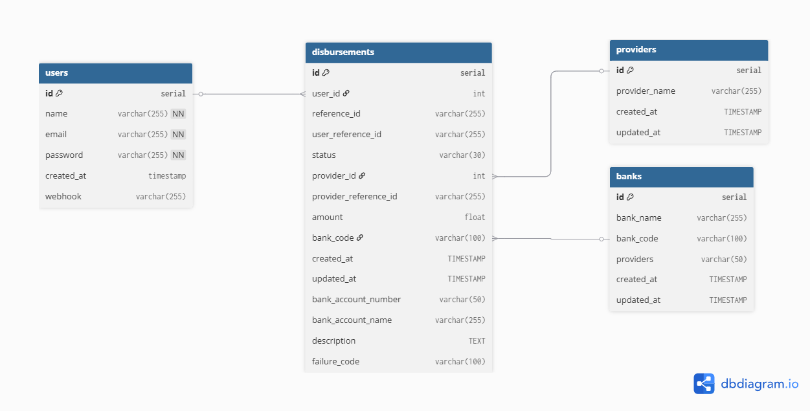

Simple payment aggregator app that's still being worked on. The app uses microservices for learning purposes.

**Stack:** Go, PostgreSQL, gorilla/mux, pgx, Redis, RabbitMQ, Grafana

**API Docs:** [link](https://kietpa.github.io/projects/letspay/)

# Features
- Monorepo microservice architecture
- Disbursements using Xendit & Midtrans
- Grafana logging using Loki & Promtail
- Message queue system using RabbitMQ
- Redis for idempotency & caching
- Simple JWT user system
- Scheduler to update pending disbursements

# How to Run
1. add provider credentials in the .sample.env file in the payments service
2. rename the .sample.env files to .env (in root and each service)
3. run docker on your machine
4. make run
5. make migrate-up
6. send requests at http://localhost:8080

### To test provider webhooks:
1. run app and expose http://localhost:8080 with ngrok, cloudflare tunneling, etc
2. fill the webhook url in the provider dashboards (eg: https://exposedurl.com/callback/xendit)
3. Transactions will automatically update once the provider sends a callback (which are usually instant) 

note: Midtrans API key for disbursements (IRIS) needs business registration

### To test user webhooks:
1. Prepare your endpoint to receive callbacks (eg: webhook.site)
2. Add webhook at http://localhost:8080/user/webhook
3. Once a transaction gets a final status, the callback will be sent to the webhook

# Database Schema

# To do
- [x] user system with JWT auth
- [x] Basic disbursement system (create, get status, webhook)
- [x] cron to check & update disbursement status
- [x] add basic openapi documentation
- [x] improved logging with grafana
- [x] use redis to handle idempotency on xendit's callback retries
- [x] add other provider (midtrans) and implement provider switching
- [x] split into microservices
- [x] implement rabbitmq
- [ ] add worker pools
- [ ] handle race conditions using go routines & channels
- [ ] add rate limiter & test it
- [ ] improve caching
- [ ] improved error handling (handle provider response, database errors, catch panics)
- [ ] move struct validation to api-gateway
- [ ] handle context timeouts
- [ ] add user balance management
